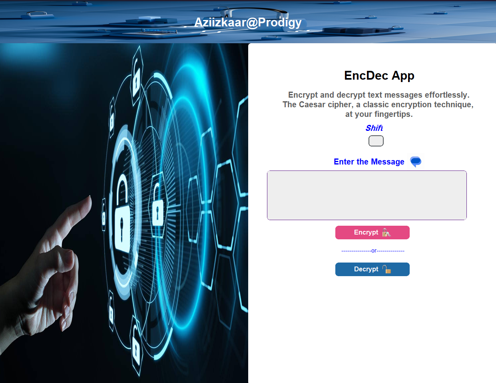

# EncDec App

## About the App
EncDec is a python GUI app that encrypts and decrypts thus converts messages in a form not understanble by unauthorized users, using Caesar Cipher's cryptographic technique.

## App interface

