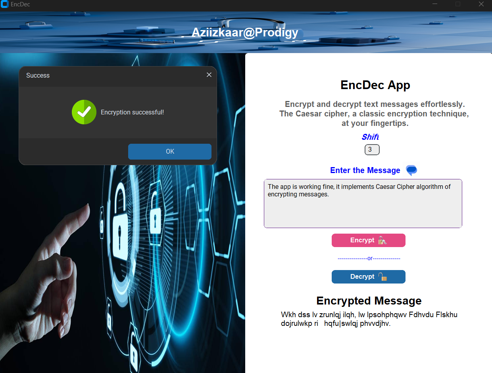
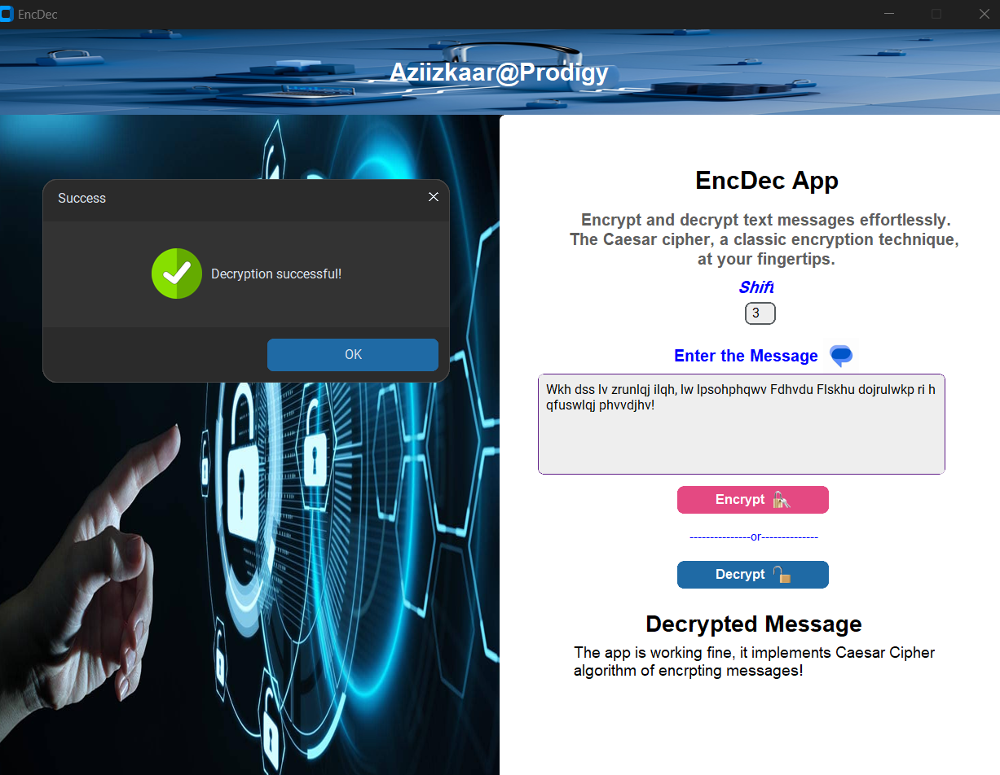

# EncDec App

## About the App
EncDec is a python GUI app that encrypts and decrypts thus converts messages in a form not understanble by unauthorized users, using Caesar Cipher's cryptographic technique.

## Relevance of the App in Cyber Security
The application preserves the confidentiality aspect of information security by making messages inaccessible and indecipherable to unauthorized individuals.

## App interface

## How the EncDec works
EncDec works by taking two inputs from user the user:
- Shift🔑: This is a non-negative integer value that acts as a key, showing the number of spaces a character is shifted to the right or left, depending on users command.
- Message💬: This is the actual message to be encrypted🔐 or decrypted🔓 using the provided shift(key).
- Button Click: The user is required to command the app on what to do with the message, by either clicking on encrypt button to cipher the entered message or decrypt button to decipher.

If everything above goes well, the app outputs the final message.

#### Encryption
Message to encrypt: "The app is working fine, it implements Caesar Cipher algorithm of encrypting messages!"

### Decryption
Message to decrypt: "Wkh dss lv zrunlqj ilqh, lw lpsohphqwv Fdhvdu Flskhu dojrulwkp ri hqfuswlqj phvvdjhv!"

